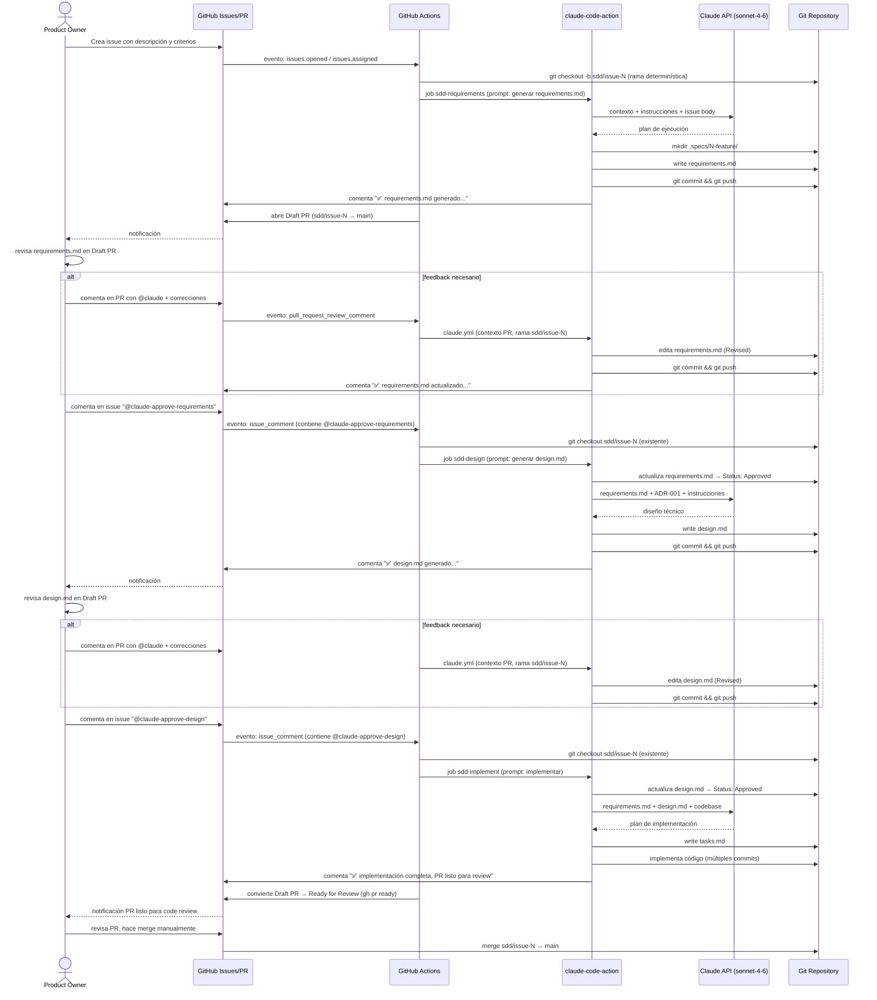

# Design — Spec Driven Development (SDD) Workflow

## Issue: #10 — Spike: adoptar spec driven development
## Version: v1.0
## Date: 2026-04-12
## Status: Revised

---

## Arquitectura propuesta

### Visión general

El workflow SDD se implementa como un sistema de orquestación agéntica sobre GitHub, usando GitHub Actions y Claude Code Action como motor de ejecución. No requiere infraestructura externa ni nuevas dependencias de runtime.

```
┌────────────────────────────────────────────────────────────────────────┐
│                        GITHUB PLATFORM                                 │
│                                                                        │
│  ┌──────────────┐     ┌─────────────────────────────────────────────┐  │
│  │   Issue #N   │────►│       GitHub Actions (sdd-feature.yml)      │  │
│  │  (trigger)   │     │         Event-driven orchestrator           │  │
│  └──────────────┘     └────────────┬────────────────────────────────┘  │
│                                    │                                    │
│          ┌─────────────────────────┼────────────────────────┐          │
│          ▼                         ▼                         ▼          │
│  ┌───────────────┐      ┌──────────────────┐      ┌─────────────────┐  │
│  │  sdd-require- │      │   sdd-design     │      │ sdd-implement   │  │
│  │  ments job    │      │   job            │      │ job             │  │
│  │  (on: opened) │      │  (on: approve-   │      │ (on: approve-   │  │
│  └───────┬───────┘      │   requirements)  │      │  design)        │  │
│          │              └────────┬─────────┘      └────────┬────────┘  │
│          ▼                       ▼                          ▼           │
│  ┌────────────────────────────────────────────────────────────────────┐ │
│  │                   claude-code-action@v1                            │ │
│  │              (Claude Sonnet — agente de ejecución)                 │ │
│  └──────────────────────────────┬─────────────────────────────────────┘ │
│                                 │                                        │
│         ┌───────────────────────┼──────────────────────┐               │
│         ▼                       ▼                        ▼              │
│  ┌─────────────┐      ┌──────────────────┐      ┌──────────────────┐   │
│  │   .specs/   │      │  Git branch      │      │  Issue/PR        │   │
│  │  <N>-feat/  │      │  sdd/issue-N     │      │  Comments        │   │
│  │  *.md files │      │  (aislamiento)   │      │  (feedback loop) │   │
│  └─────────────┘      └──────────────────┘      └──────────────────┘   │
└────────────────────────────────────────────────────────────────────────┘
          │
          ▼
   ┌─────────────┐
   │ Claude API  │
   │ sonnet-4-6  │
   └─────────────┘
```

---

### Capas del sistema

| Capa | Componente(s) | Responsabilidad |
|---|---|---|
| **Trigger** | GitHub Issues / Issue Comments | Punto de entrada del ciclo; activa el workflow via eventos |
| **Orquestación** | `sdd-feature.yml` (GitHub Actions) | Detecta el evento, selecciona el job correspondiente a la fase |
| **Ejecución IA** | `claude-code-action@v1` | Corre Claude como agente con acceso a herramientas de repo y Git |
| **Contexto** | `CLAUDE.md`, `docs/`, `ADR-001` | Instrucciones y restricciones que guían las decisiones del agente |
| **Specs** | `.specs/<N>-feature/*.md` | Artefactos versionados de cada fase (requirements, design, tasks) |
| **Aislamiento** | Rama `sdd/issue-<N>` (determinística) + Draft PR | Cada ciclo SDD opera en su propia rama; las correcciones se centralizan en el PR sin crear ramas adicionales |
| **Aprobación** | Comentarios en Issue (`@claude-approve-*`) | Compuertas explícitas controladas por el product owner |
| **Entrega** | Pull Request | Artefacto final de la fase de implementación; merge manual |

---

### Estructura de archivos del workflow

```
.github/
└── workflows/
    ├── claude.yml               # Workflow general de Claude (review, preguntas)
    ├── sdd-feature.yml          # Workflow SDD: 3 jobs (requirements, design, implement)
    ├── claude-review.yml        # Workflow de revisión de código en PRs
    └── update-docs.yml          # Workflow de actualización de documentación

.specs/
└── <issue-id>-feature/
    ├── requirements.md          # Fase 1: User stories + GIVEN/WHEN/THEN
    ├── design.md                # Fase 2: Arquitectura + decisiones técnicas
    └── tasks.md                 # Fase 3: Tareas de implementación (generado por agente)

docs/
├── problem-statement.md         # Contexto del producto (input estático)
├── decisions/
│   └── ADR-001-*.md             # ADRs del stack (input estático)
└── sdd-workflow-guide.md        # Guía de uso del workflow SDD (nuevo)

CLAUDE.md                        # Instrucciones globales para el agente (nuevo/actualizar)
```

---

### Mecanismo de bloqueo de PR sin specs (US-05 Scenario 2)

Cuando un PR intenta implementar una feature sin directorio `.specs/` asociado, el bloqueo se aplica así:

1. El evento `pull_request: [opened, synchronize]` activa `claude-review.yml` → job `spec-review`
2. El agente extrae el número de issue desde el título o body del PR
3. Verifica la existencia del directorio `.specs/<issue-id>-feature/` en el repositorio
4. **Si el directorio no existe:**
   - El agente publica un comentario bloqueante en el PR indicando el path esperado (`.specs/<N>-feature/`)
   - El job finaliza con código de salida no-cero → estado `failure` en GitHub
5. La branch protection rule en `main` requiere que el check `spec-review` pase antes de habilitar el merge
6. Con el job en `failure`, GitHub deshabilita el botón de merge hasta que las specs existan

**Pre-requisito de configuración:** Activar branch protection en `main` con required status check `spec-review` (GitHub → Settings → Branches → Branch protection rules → Require status checks to pass → `spec-review`).

**Cambio requerido en `claude-review.yml`:** El prompt del job `spec-review` debe incluir la instrucción explícita: si `.specs/<issue-id>-feature/` no existe, publicar comentario de bloqueo y finalizar con error. Este cambio se especifica como tarea de implementación en `tasks.md`.

---

## Diagrama de secuencia



---

## Decisiones técnicas

### DT-001 — Markdown como formato de specs

**Decisión:** Todos los artefactos del workflow SDD se escriben en Markdown plano (`.md`).

**Alternativas consideradas:**
- YAML estructurado (machine-readable pero difícil de leer para el product owner)
- Notion / Confluence (legible pero fuera del repositorio, sin versionado junto al código)
- OpenAPI / JSON Schema (demasiado específico de dominio, no aplica a user stories)

**Justificación:** Markdown es el único formato que cumple simultáneamente:
1. Legible por humanos sin herramientas adicionales
2. Legible por LLMs como contexto estructurado
3. Versionable en Git junto al código fuente
4. Renderizable en GitHub (issues, PRs, archivos)
5. Sin costo adicional ni dependencias externas

**Consecuencia:** Los specs son código. Se revisan, mergean y auditan igual que el código fuente.

---

### DT-002 — Comentarios de GitHub como interfaz de comandos

**Decisión:** Las transiciones entre fases del workflow se activan mediante comandos en comentarios de GitHub Issue (`@claude-approve-requirements`, `@claude-approve-design`).

**Alternativas consideradas:**
- Labels de GitHub (visibles pero no permiten texto contextual en el mismo gesto)
- Webhooks externos con UI custom (overhead innecesario, rompe restricción $0)
- Aprobación automática por tiempo o criterios (elimina la revisión humana, inseguro)

**Justificación:** Los comentarios de GitHub son:
1. **Auditable:** todo el historial de aprobaciones queda en el issue
2. **Contextual:** el product owner puede agregar feedback junto al comando
3. **Familiar:** no requiere aprender nuevas herramientas
4. **Alineado al stack:** `sdd-feature.yml` ya filtra mediante dos condiciones separadas y literales: `contains(github.event.comment.body, '@claude-approve-requirements')` y `contains(github.event.comment.body, '@claude-approve-design')`

**Consecuencia:** El product owner debe tener acceso de escritura al repositorio para que sus comentarios activen el workflow.

---

### DT-003 — Una rama determinística por ciclo SDD con Draft PR

**Decisión:** Cada ciclo SDD opera en una rama con nombre fijo `sdd/issue-<N>` (sin timestamp). Las tres fases (requirements, design, implement) conviven en la misma rama. Un Draft PR se abre automáticamente al finalizar la fase de requirements y actúa como centro de colaboración para correcciones.

**Alternativas consideradas:**
- `branch_prefix: "sdd/"` con timestamp en cada fase (implementación original) — crea una rama por fase, artefactos anteriores no disponibles sin merge previo
- Merge automático a `main` entre fases — specs llegan a `main` sin revisión formal
- Rama determinística sin Draft PR — correcciones via `@claude` en el issue crean ramas nuevas

**Justificación:** El modelo Draft PR resuelve todos los escenarios de corrección identificados:
1. **Una sola rama por ciclo:** `git log sdd/issue-<N>` muestra el ciclo completo (requirements → design → impl)
2. **Sin dependencia de merges intermedios:** `sdd-design` e `sdd-implement` hacen checkout de `sdd/issue-<N>` y tienen acceso a todos los artefactos anteriores sin necesidad de PR mergeados
3. **Correcciones en contexto PR:** `@claude` en el Draft PR usa `claude.yml` en contexto PR, que pushea a la rama del PR (sin crear nueva rama) — resuelve escenarios S-02, S-04, S-06
4. **Estado visible:** el Draft PR refleja el estado del ciclo (Draft = en revisión de specs, Ready = listo para code review)

**Transición de aprobaciones:**
- Correcciones durante cualquier fase → comenta en el **PR** con `@claude [feedback]`
- Aprobación de fase → comenta en el **issue** con `@claude-approve-requirements` o `@claude-approve-design`

**Consecuencia:** El PR final contiene tanto los archivos `.specs/` como el código implementado. El historial de commits en `sdd/issue-<N>` refleja el ciclo completo incluyendo correcciones iterativas.

---

### DT-004 — Compuertas de aprobación explícitas entre fases

**Decisión:** El agente no avanza automáticamente entre fases. Cada transición requiere un comando explícito del product owner.

**Alternativas consideradas:**
- Pipeline completamente automático (requirements → design → impl sin intervención)
- Aprobación por inactividad (si no hay feedback en 24h, se aprueba automáticamente)
- Aprobación por criterio de calidad del LLM (el agente se auto-aprueba si el doc cumple ciertos criterios)

**Justificación:** Las aprobaciones automáticas eliminan el valor central del SDD: que un humano valide cada artefacto antes de que el agente avance. El costo de una aprobación incorrecta (código mal diseñado llegando a `main`) es mayor que el costo de un comentario de aprobación manual.

**Consecuencia:** El ciclo SDD completo requiere al menos 2 acciones explícitas del product owner antes de que exista código implementado.

---

### DT-005 — claude-code-action como motor de orquestación

**Decisión:** `anthropics/claude-code-action@v1` es el único componente de ejecución del agente. No se usa un orchestrator custom ni scripts intermediarios.

**Alternativas consideradas:**
- Script Python custom en GitHub Actions que llame a Claude API directamente
- n8n / Make como orchestrator externo (descartado por ADR-001: costo y lock-in)
- GitHub Copilot Workspace (no disponible para repositorios privados en free tier)

**Justificación:** `claude-code-action` ya provee:
1. Manejo de contexto del repositorio (checkout, herramientas de lectura/escritura)
2. Gestión de ramas (`branch_prefix`)
3. Comentarios persistentes en issues/PRs (`use_sticky_comment`)
4. Permisos de escritura al repo (`contents: write`)
5. Tracking de progreso (`track_progress: true`)

Implementar esto desde cero agrega complejidad sin beneficio para v1.

**Consecuencia:** El workflow queda acoplado a `claude-code-action@v1`. Si Anthropic depreca esta action, el workflow requiere migración. Riesgo aceptable dado que es el stack recomendado por el proveedor del modelo.

---

### DT-006 — CLAUDE.md como configuración del agente

**Decisión:** Las instrucciones persistentes para el agente (convenciones del proyecto, restricciones técnicas, formato de specs) se documentan en `CLAUDE.md` en la raíz del repositorio.

**Justificación:** `claude-code-action` carga automáticamente `CLAUDE.md` como contexto del sistema en cada ejecución. Esto evita repetir instrucciones en cada `prompt:` de `sdd-feature.yml` y garantiza consistencia entre todos los workflows del repositorio.

**Consecuencia:** `CLAUDE.md` debe actualizarse cuando cambien las convenciones del proyecto. Es el "contrato de comportamiento" del agente para este repositorio.

---

## Impacto en codebase existente

### Estado actual del repositorio

```
.github/workflows/
├── claude.yml           ✅ existente — workflow general de Claude
├── sdd-feature.yml      ✅ existente — workflow SDD (3 jobs implementados)
├── claude-review.yml    ✅ existente
└── update-docs.yml      ✅ existente

.specs/
├── 4-feature/           ✅ existente — ciclo SDD del issue #4
│   ├── requirements.md
│   └── design.md
└── 10-feature/          ✅ existente (este ciclo)
    ├── requirements.md
    └── design.md         ← este archivo

docs/
├── problem-statement.md          ✅ existente
└── decisions/ADR-001-*.md        ✅ existente

CLAUDE.md                         ❌ no existe — debe crearse
```

### Cambios requeridos post-aprobación de este design

| Área | Tipo | Descripción | Prioridad |
|---|---|---|---|
| `CLAUDE.md` | **Crear** | Instrucciones globales del agente: stack, convenciones, formato de specs, restricciones | Alta |
| `docs/sdd-workflow-guide.md` | **Crear** | Guía de uso del workflow SDD para el product owner (cómo crear un issue, comandos disponibles, qué esperar en cada fase) | Alta |
| `.specs/10-feature/tasks.md` | **Crear** (fase impl.) | Lista de tareas de implementación, generada automáticamente cuando se apruebe este design | Media |
| `sdd-feature.yml` | **Actualizado** | Implementa Alt 2 (DT-003 rev): rama determinística `sdd/issue-N`, Draft PR automático, checkout de rama existente en fases 2 y 3, `gh pr ready` al finalizar implementación | Alta |
| `claude-review.yml` | **Actualizar** | Agregar verificación de directorio `.specs/<issue-id>-feature/`; si no existe, el job falla y bloquea el merge (US-05 Scenario 2). Requiere activar branch protection con required status check `spec-review` en `main` | Alta |
| `claude.yml` | **Sin cambio** | Workflow general no necesita modificación | — |
| `docs/problem-statement.md` | **Sin cambio** | Solo lectura como contexto del agente | — |
| `docs/decisions/ADR-001-*.md` | **Sin cambio** | Solo lectura como restricciones técnicas | — |
| `src/` (código GAS) | **Sin cambio** | El workflow SDD es infraestructura del SDLC, no modifica el producto Finanzas C&C | — |

---

### Contenido propuesto para CLAUDE.md

```markdown
# CLAUDE.md — Instrucciones para el agente Claude

## Contexto del proyecto
Ver docs/problem-statement.md para el problema de negocio.
Ver docs/decisions/ADR-001-stack-tecnologico.md para el stack tecnológico.

## Stack tecnológico
- Implementación: Google Apps Script (JavaScript)
- Almacenamiento: Google Sheets
- Modelo de IA: claude-sonnet-4-6 (o superior)
- CI/CD: GitHub Actions + claude-code-action@v1

## Workflow SDD
Al trabajar en un issue con ciclo SDD:
1. Lee .specs/<issue-id>-feature/requirements.md antes de cualquier acción
2. Lee .specs/<issue-id>-feature/design.md antes de implementar
3. No implementes nada que no esté especificado en el design.md aprobado
4. Si detectas un gap en el design durante la implementación, documéntalo en el PR

## Convenciones de commits
- Prefijo: feat|fix|docs|chore|test
- Referencia al issue: #N al final del mensaje
- Co-authored-by cuando el usuario lo indica

## Restricciones
- No crear branches adicionales al asignado por el workflow
- No hacer push a main directamente
- No modificar .github/workflows/ sin instrucción explícita
- No instalar dependencias externas (no hay package.json)
```

---

### Sin impacto en

- Código fuente de Finanzas C&C en `src/` — el workflow SDD es infraestructura del SDLC, no modifica el producto
- Base de datos en Google Sheets — sin cambios en estructura de datos
- Triggers de Google Apps Script — sin cambios en la ejecución del pipeline de gastos
- Usuarios finales del sistema — los cambios son internos al proceso de desarrollo

---

## Consideraciones de seguridad

| Riesgo | Mitigación |
|---|---|
| Cualquier colaborador puede activar el workflow con `@claude` | GitHub Actions solo ejecuta en comentarios de issues/PRs del repositorio; requiere acceso de escritura |
| El agente podría hacer push a ramas críticas | Rama `sdd/issue-N` creada determinísticamente por el workflow (no por el agente); `main` requiere PR + aprobación manual |
| Prompt injection en el cuerpo del issue | `claude-code-action` sanitiza el contexto; el agente opera con herramientas limitadas (`--allowedTools`) |
| Exposición de secretos en logs | `CLAUDE_CODE_OAUTH_TOKEN` y `GIT_HUB_PAT` son GitHub Secrets; no aparecen en logs |
| Ejecución de código arbitrario via specs | Las herramientas permitidas en `sdd-feature.yml` están acotadas: `Bash(git *), Read, Write, Edit` |

---

## Fuera de alcance (v1 del design)

- Implementación de `CLAUDE.md` y `docs/sdd-workflow-guide.md` — se generan en la fase de implementación
- Modificaciones al workflow de `sdd-feature.yml` — ya está implementado y funcionando
- Integración con herramientas externas de gestión de proyectos
- Dashboard de métricas del workflow SDD (velocidad, ciclos completados)
- Tests automatizados para los workflows de GitHub Actions
