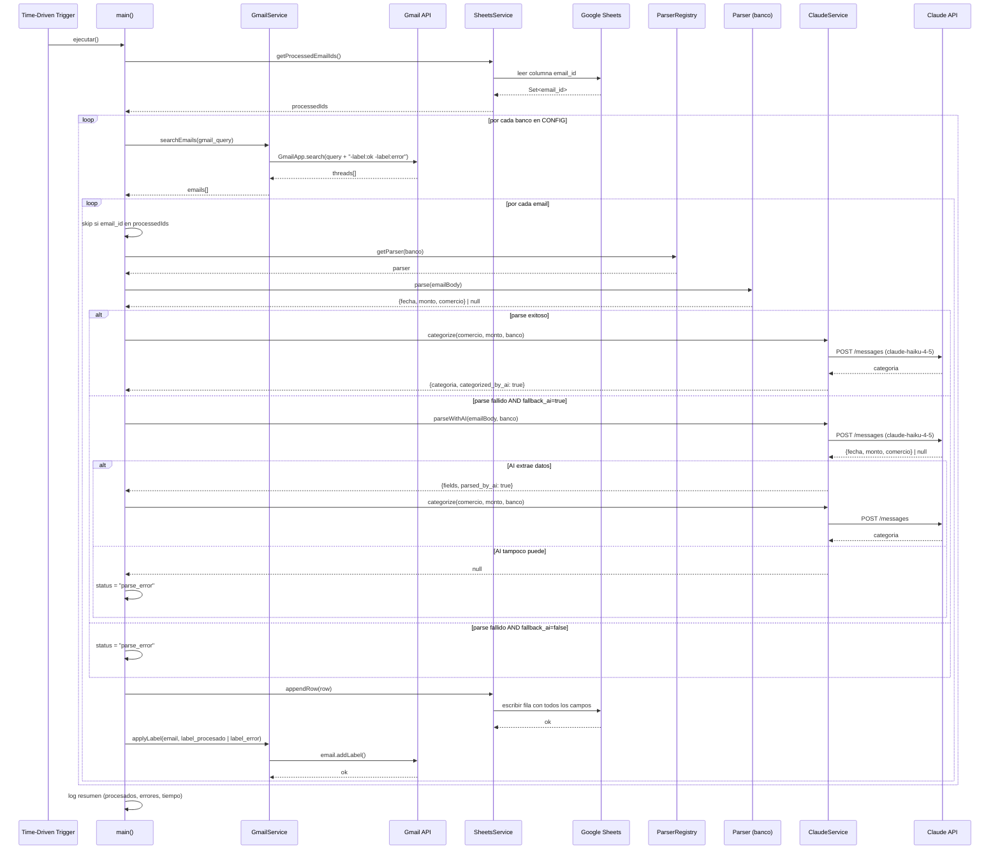

# Design — Email Ingestion Pipeline

## Issue: #4 — BCP, Interbank, BBVA, Scotiabank, Yape/Plin
## Version: v1.0
## Date: 2026-04-03
## Status: Draft

---

## Arquitectura propuesta

### Visión general

El pipeline se implementa íntegramente en Google Apps Script como un único proyecto (`Code.gs` + módulos auxiliares). No hay servidores externos ni dependencias de terceros más allá de Claude API.

```
┌─────────────────────────────────────────────────────────────────────┐
│                        GOOGLE APPS SCRIPT                           │
│                                                                     │
│  ┌──────────────┐    ┌──────────────────────────────────────────┐  │
│  │   Trigger    │───►│              main()                      │  │
│  │  (diario)    │    │         Orchestrator                     │  │
│  └──────────────┘    └──────────┬───────────────────────────────┘  │
│                                 │                                   │
│              ┌──────────────────┼──────────────────────┐           │
│              ▼                  ▼                       ▼           │
│  ┌────────────────┐  ┌─────────────────┐  ┌──────────────────────┐ │
│  │  GmailService  │  │  ParserRegistry │  │   SheetsService      │ │
│  │  (read/label)  │  │  (per-bank)     │  │   (read/write)       │ │
│  └────────────────┘  └────────┬────────┘  └──────────────────────┘ │
│                               │                                     │
│              ┌────────────────┼────────────────────┐               │
│              ▼                ▼                     ▼               │
│  ┌──────────────────┐  ┌──────────┐  ┌──────────────────────────┐  │
│  │  BcpParser       │  │  ...     │  │  ClaudeService           │  │
│  │  InterbankParser │  │          │  │  (categorize + fallback) │  │
│  │  BbvaParser      │  │          │  └──────────────────────────┘  │
│  │  ScotiabankParser│  │          │                                 │
│  │  YapeParser      │  │          │                                 │
│  │  PlinParser      │  │          │                                 │
│  └──────────────────┘  └──────────┘                                │
└─────────────────────────────────────────────────────────────────────┘
          │                                        │
          ▼                                        ▼
   ┌─────────────┐                        ┌───────────────┐
   │    Gmail    │                        │  Claude API   │
   │  (2 cuentas)│                        │ haiku-4-5     │
   └─────────────┘                        └───────────────┘
          │
          ▼
   ┌─────────────────────┐
   │   Google Sheets     │
   │  (gastos + config)  │
   └─────────────────────┘
```

---

### Capas del sistema

| Capa | Módulo(s) | Responsabilidad |
|---|---|---|
| **Orquestación** | `main.gs` | Entry point del trigger; coordina el pipeline completo |
| **Configuración** | `config.gs` | Objeto CONFIG central con parámetros por banco |
| **Ingesta Gmail** | `gmail-service.gs` | Buscar emails sin procesar, leer cuerpo, aplicar labels |
| **Parseo** | `parsers/<banco>.gs` | Extraer campos (fecha, monto, comercio) por banco via regex |
| **IA** | `claude-service.gs` | Categorización + fallback de parseo via Claude API |
| **Almacenamiento** | `sheets-service.gs` | Leer email_ids procesados, escribir filas, deduplicar |
| **Utilidades** | `utils.gs` | Normalización de fechas, montos, logging |

---

### Estructura de archivos propuesta

```
src/
├── main.gs                  # Orquestador principal + trigger entry point
├── config.gs                # CONFIG object (bancos, Sheets IDs, Claude API key)
├── gmail-service.gs         # GmailService: search, getBody, applyLabel
├── sheets-service.gs        # SheetsService: getProcessedIds, appendRow
├── claude-service.gs        # ClaudeService: categorize, parseWithAI
├── utils.gs                 # parseDate, parseAmount, normalizeText, log
└── parsers/
    ├── bcp-parser.gs        # BcpParser: regex para emails BCP
    ├── interbank-parser.gs  # InterbankParser: regex para emails Interbank
    ├── bbva-parser.gs       # BbvaParser: regex para emails BBVA
    ├── scotiabank-parser.gs # ScotiabankParser: regex para emails Scotiabank
    ├── yape-parser.gs       # YapeParser: regex para emails Yape
    └── plin-parser.gs       # PlinParser: regex para emails Plin
```

---

## Diagrama de secuencia



---

## Decisiones técnicas

### DT-001 — Un proyecto Apps Script por usuario vs. uno compartido

**Decisión:** Un único proyecto Apps Script con acceso delegado a ambas cuentas Gmail.

**Alternativas consideradas:**
- Un script por usuario (2 proyectos independientes)
- Un script central con GmailApp como servicio delegado

**Justificación:** Apps Script permite usar `GmailApp` directamente para la cuenta del propietario del script, pero para leer Gmail de una segunda cuenta se requiere autorización OAuth o Google Workspace Domain-Wide Delegation. Para v1 con 2 usuarios domésticos (no corporativos), la solución más pragmática es que cada usuario autoriza su propio script, o bien se usa un único script con ambas cuentas autorizadas vía `ScriptApp.getOAuthToken()`.

**Resolución práctica para v1:** El script se despliega dos veces (una instancia por cuenta Gmail). Cada instancia escribe en la **misma** Google Sheets (acceso compartido). El campo `usuario` se configura en `CONFIG.usuario` de cada instancia.

> **Consecuencia:** Operación simple, sin OAuth cross-account. Trade-off: 2 triggers diarios en lugar de 1.

---

### DT-002 — Estructura del objeto CONFIG central

**Decisión:** Un objeto literal JavaScript en `config.gs` con todos los parámetros configurables. No se usa PropertiesService para la configuración estructural.

```javascript
const CONFIG = {
  spreadsheetId: "SHEET_ID_AQUI",
  sheetName: "gastos",
  usuario: "usuario1",  // cambiar en la segunda instancia
  claudeApiKey: PropertiesService.getScriptProperties().getProperty("CLAUDE_API_KEY"),
  bancos: {
    bcp: {
      gmail_query: "from:(alertas@notificacionesbcp.com) subject:(consumo OR cargo)",
      label_procesado: "ingesta/bcp/ok",
      label_error: "ingesta/bcp/error",
      parser: "bcp",
      fallback_ai: true,
      banco_nombre: "BCP"
    },
    interbank: { /* ... */ },
    bbva:      { /* ... */ },
    scotiabank: { /* ... */ },
    yape:      { /* ... */ },
    plin:      { /* ... */ }
  }
};
```

**Justificación:** PropertiesService se usa solo para secretos (Claude API key). El resto de la configuración es código — versionable, legible, sin overhead de UI.

---

### DT-003 — Interfaz común para parsers (Parser Protocol)

**Decisión:** Cada parser expone exactamente una función `parse(body: string): ParsedEmail | null`.

```javascript
// Tipo de retorno común a todos los parsers
// {
//   fecha: string,        // YYYY-MM-DD
//   monto: number,        // PEN, positivo
//   comercio: string,     // nombre del comercio o destinatario
//   raw: string           // cuerpo original (para debugging)
// }
```

**Justificación:** Interfaz mínima permite al orquestador tratar todos los parsers de forma uniforme. Facilita agregar nuevos bancos sin tocar `main.gs`.

---

### DT-004 — Claude API: dos responsabilidades distintas

**Decisión:** `ClaudeService` expone dos métodos con prompts separados:

1. `categorize(comercio, monto, banco)` → siempre se llama para gastos parseados exitosamente
2. `parseWithAI(emailBody, banco)` → solo se llama cuando el regex falla y `fallback_ai=true`

**Modelo:** `claude-haiku-4-5` para ambos casos (costo mínimo, latencia ~1s).

**Prompt de categorización:**
```
Clasifica este gasto en una sola categoría de la lista.
Comercio: {comercio}
Monto: S/ {monto}
Banco: {banco}
Categorías válidas: Supermercado, Restaurante, Transporte, Salud, Educación,
Entretenimiento, Ropa, Tecnología, Hogar, Servicios, Transferencia, Otro
Responde SOLO con el nombre de la categoría, sin explicación.
```

**Prompt de parseo fallback:**
```
Extrae los datos de gasto de este email bancario peruano.
Banco: {banco}
Email: {body}
Responde en JSON con exactamente estos campos:
{"fecha": "YYYY-MM-DD", "monto": number, "comercio": "string"}
Si no puedes extraer algún campo, responde null.
```

**Justificación:** Prompts especializados reducen errores vs. un prompt genérico. La separación permite iterar cada prompt independientemente.

---

### DT-005 — Deduplicación en dos capas

**Decisión:** Doble verificación: Gmail labels (capa primaria) + `email_id` en Sheets (capa secundaria).

Ver mecanismo completo en [`requirements.md#mecanismo-de-deduplicacion`](./requirements.md).

**Justificación:** La capa de Gmail labels es O(1) por ser filtro en la query. La capa de Sheets protege ante edge cases de red (script termina antes de aplicar el label). El costo de leer la columna `email_id` al inicio es aceptable dado el volumen bajo (~30-50 emails/día para 2 usuarios).

---

### DT-006 — Manejo de errores: fail-open por email

**Decisión:** Si un email individual falla (parse error, timeout de API, error de red), se registra con `status="parse_error"` y el pipeline continúa con el siguiente email. El script **nunca se interrumpe** por un email individual.

**Justificación:** Un error en un email de Scotiabank no debe bloquear el procesamiento de los emails de BCP. La visibilidad de errores viene del campo `status` en Sheets y del registro de logs en Apps Script.

---

### DT-007 — Gestión del límite de 6 minutos

**Decisión:** El pipeline procesa emails en orden FIFO. Si se acerca al límite de tiempo (verificación cada N emails via `Date.now()`), guarda un checkpoint en PropertiesService y termina limpiamente. En la siguiente ejecución diaria, continúa desde el checkpoint.

**Estimación de throughput:**
- Parseo regex: ~10ms/email
- Claude API (categorización): ~1-2s/email
- Claude API (fallback parseo): ~2-3s/email
- Sheets write: ~100ms/email

Con 30-50 emails/día y ~2s promedio por email = ~60-100s total. Holgadamente dentro del límite de 6 minutos para el volumen esperado de v1.

**Justificación:** El checkpoint es una precaución para días con alto volumen (viajes, gastos extraordinarios). No se espera que se active en uso normal.

---

## Impacto en codebase existente

### Estado actual del repositorio

El repositorio actualmente contiene:
- `docs/` — documentación de contexto y decisiones (ADR-001, problem-statement)
- `.specs/` — especificaciones del pipeline (requirements.md)
- Sin código fuente en `src/`

### Cambios requeridos

| Área | Tipo de cambio | Detalle |
|---|---|---|
| `src/` | Crear (nuevo) | Directorio con todos los módulos Apps Script |
| `src/main.gs` | Crear (nuevo) | Orquestador principal |
| `src/config.gs` | Crear (nuevo) | CONFIG central con parámetros |
| `src/gmail-service.gs` | Crear (nuevo) | Abstracción sobre GmailApp |
| `src/sheets-service.gs` | Crear (nuevo) | Abstracción sobre SpreadsheetApp |
| `src/claude-service.gs` | Crear (nuevo) | Cliente Claude API (categorize + parseWithAI) |
| `src/utils.gs` | Crear (nuevo) | Helpers: fechas, montos, logging |
| `src/parsers/bcp-parser.gs` | Crear (nuevo) | Parser regex BCP |
| `src/parsers/interbank-parser.gs` | Crear (nuevo) | Parser regex Interbank |
| `src/parsers/bbva-parser.gs` | Crear (nuevo) | Parser regex BBVA |
| `src/parsers/scotiabank-parser.gs` | Crear (nuevo) | Parser regex Scotiabank |
| `src/parsers/yape-parser.gs` | Crear (nuevo) | Parser regex Yape |
| `src/parsers/plin-parser.gs` | Crear (nuevo) | Parser regex Plin |
| `appsscript.json` | Crear (nuevo) | Manifest de Apps Script con scopes OAuth |
| `README.md` | Crear (nuevo) | Instrucciones de setup y despliegue |

### Sin impacto en

- `docs/` — solo lectura, no se modifica
- `.specs/` — solo se agrega `design.md`

### Dependencias externas requeridas

| Dependencia | Cómo se configura |
|---|---|
| Claude API key | `PropertiesService.getScriptProperties()` en Apps Script |
| Google Sheets ID | `CONFIG.spreadsheetId` en `config.gs` |
| Gmail labels | Se crean automáticamente por Apps Script si no existen |
| Time-driven trigger | Setup manual una vez vía UI de Apps Script o via `ScriptApp.newTrigger()` |

### Scopes OAuth requeridos (`appsscript.json`)

```json
{
  "oauthScopes": [
    "https://www.googleapis.com/auth/gmail.modify",
    "https://www.googleapis.com/auth/spreadsheets",
    "https://www.googleapis.com/auth/script.external_request"
  ]
}
```

> `gmail.modify` es necesario para aplicar labels. `external_request` permite llamadas a Claude API via `UrlFetchApp`.

---

## Estructura de Google Sheets

### Hoja `gastos`

| Columna | Campo | Notas |
|---|---|---|
| A | `fecha` | YYYY-MM-DD, formato texto |
| B | `monto` | Número, PEN |
| C | `comercio` | Texto |
| D | `banco` | BCP / Interbank / BBVA / Scotiabank / Yape / Plin |
| E | `usuario` | usuario1 / usuario2 |
| F | `categoria` | Categoría asignada o "Sin categorizar" |
| G | `categorized_by_ai` | TRUE / FALSE |
| H | `parsed_by_ai` | TRUE / FALSE |
| I | `status` | ok / parse_error |
| J | `email_id` | ID único de Gmail (para deduplicación) |
| K | `timestamp_ingesta` | ISO 8601, UTC-5 (America/Lima) |

### Hoja `config` (opcional)

Hoja auxiliar para visualizar el CONFIG activo. No es fuente de verdad — solo para troubleshooting.

---

## Consideraciones de seguridad

| Riesgo | Mitigación |
|---|---|
| Claude API key expuesta en código | Almacenar en `PropertiesService`, nunca en `config.gs` |
| Acceso a Gmail de ambos usuarios | Cada instancia del script corre en la cuenta del propietario; no hay cross-account |
| Inyección en prompts de Claude | El cuerpo del email se sanitiza (remover caracteres de control) antes de enviarse a Claude API |
| Datos sensibles en logs | `utils.log()` omite el cuerpo completo del email; solo registra asunto y email_id |
